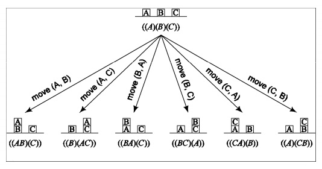
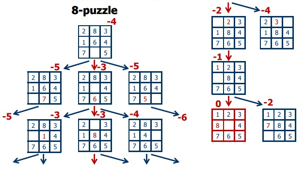

## Búsqueda en Inteligencia Artificial
* * *
Las técnicas de búsqueda son métodos universales para la solución de problemas en Inteligencia Artificial. Dentro de la inteligencia artificial hablar sobre términos de resolución de problemas y búsqueda hacen referencia a técnicas como deducción, plan de acción, razonamiento común, etc. Las aplicaciones de ideas generales como las mencionadas aparecen en los sistemas inteligentes, ya sea en programas que tratan de sintetizar un conjunto de reglas o en sistemas que realizan inferencias desde un conjunto de reglas ya dado. 

Partamos por un ejemplo simple, caminar o conducir de un punto A a otro punto B en una ciudad con muchas calles; hay muchas rutas que se pueden trazar, además de puntos inciales (A) y finales (B). Los algoritmos de búsqueda son buenos para resolver este tipo de problemas.

Para llegar a resolver estos problemas entre otros, tendremos que construir un modelo sobre la cuál basar nuestras decisiones en las consecuencias (hipotéticas) de nuestras acciones. La búsqueda la realiza un programa (ya diseñado), en donde el espacio de búsqueda determinado será un **grafo dirigido**, del cual cada nodo representa uno de los posibles estados del sistema.

Dependiendo de la complejidad podemos tener:

## Búsqueda Heurística
* * *
Durante la generación de árboles de búsqueda, podemos guiarnos con [heurísticas](https://en.wikipedia.org/wiki/Heuristic_(computer_science)) que nos brinden una idea acerca de cuán bueno es cierto operador.El uso de heurísticas nos permite convertir nuestra búsqueda para una solución en un ***Proceso Guiado*** de multiples ensayos y errores, estimando el *coste* necesario para alcanzar una solución a partir del estado actual.

Finalidad del uso de estos algoritmos: Encontrar el camino de costo mínimo desde un $s_{start}$ hacia un `s` que satisfaga lo requerido `IsEnd(s)` ($Ahorro > Costo$).

Los criterios a utilizar para explorar el espacio de búsqueda son distintos, ya sean por ejemplo LIFO(**Last In First Out**) o FIFO(**First in First Out**).

Un ejemplo de esto tenemos:

## Algoritmo A*

* * *
Este algoritmo no considera el coste del camino(*path*) ya recorrido desde un inicio hasta el que se piensa avanzar. El objetivo de éste algoritmo es encontrar un ***Camino Óptimo*** (*más corto*) desde el inicio hasta que llega a su punto final, expandiendo el menor número de estados posibles.

Para un estado *n* cualquiera, llamaremos $f_{(n)}$ a nuestra función evaluadora, el cálculo del coste del camino real recorrido del inicio (raíz) hasta *n* más una estimación del coste de lo que falta recorrer de *n* hacia el punto final.
Si llamamos $h_{(n)}$ a la estimación del coste desde *n* hasta el punto final (distancia a la meta) a través de un camino óptimo (*menos costoso*); $h_{(n)}$ se calculará con la información con la que se encuentra en ese determinado momento. Si llamamos $g_{(n)}$ al coste del camino desde el inicio hasta *n* durante la búsqueda. Ahora podremos decir que nuestra función evaluadora quedaría como:

 $f_{(n)} = g_{(n)} + h_{(n)}$ 

Un ejemplo del modo de operación del algoritmo `A*` en tiempo real:

## Búsqueda con Adversarios - Juegos
* * *
Ahora, veamos situaciones *multiagente*, donde cada uno de los agentes tiene que considerar las acciones de los demás agentes y como estos podrían afectar al propio desarrollo de su juego.

Para esto, se cubren entorno competitivos, en las cual los objetivos de los agentes entran en conflicto, dando surgimiento a ***Problemas de Búsqueda con Adversarios***, más conocidos como ***Juegos***.

Estos problemas pueden ser divididos de la sigueinte manera:

* El **estado inicial** del agente en el entorno.
* Un **conjunto de acciones** que el agente puede realizar.
* Un **modelo de transición** describiendo los resultados de esas acciones.
* Un **espacio de estado**: el conjunto de todos los posibles estados del agente y el entorno.
* Una **función evaluadora** que nos informa si el objetivo fue logrado.
* **Costo de camino**, función que nos dice el coste de la solución.
* La **solución**, la cuál es un camino concreto a través del espacio de estado, desde el espacio inicial hasta el objetivo.

Tengamos en cuenta,  las siguientes comparaciones:

* Búsquedas (sin Adversario):
    + Las soluciones (heurísticas) son métodos para encontrar un objetivo.
    + Las técnicas heurísticas pueden encontrar una *óptima*.
    + La función evaluadora estima el coste desde el inicio al objetivo a través de un nodo dado.
    + Ejemplos: camino planeado, actividades agendadas.
  
* Juegos (con Adversarios):
    + La solución es ***estratégica*** (se especifíca un movimiento para cada posible respuesta del oponente).
    + Los límites de tiempo fuerzan una solución *aproximada*.
    + La función evaluadora estima **"cuán buena"** es la posición del juego.
    + Ejemplos: Ajedrez, Damas, Tic-tac-Toe (Tres en Raya).

Tipos de Juegos a considerar:

|                                                     |         Determinista                  |     Movimientos al Azar    |
| :-------------: | :------: | :----------: |
|                Información Perfecta                 | Ajedrez, Damas, Tic-tac-Toe, Othello  |   Backgammon, Monopolio    |
| Información Imperfecta (Movimiento Inicial al Azar) |         Bridge, Skat                  | Poker, Scrabble, BlackJack |
**Tabla 1.** Tipos de Juego

Para una mayor información de Juegos y Búsqueda con Adversarios se puede revisar el siguiente [enlace](http://dai.fmph.uniba.sk/courses/intro-ai/lectures/L03-search-games.pdf).

## Referencias
* * *

En Español:

* [Búsqueda en Inteligencia Artificial](http://elvex.ugr.es/decsai/iaio/slides/A3%20Search.pdf).
* [Inteligencia Artificial: Introducción y tareas de Búsqueda](http://www.aconute.es/iartificial/documentos/ia_intro_busqueda.pdf).
* [Búsqueda con Adversario](https://www.cs.us.es/cursos/ia1/temas/tema-07.pdf).
* [Búsqueda Heurística](http://www.iiia.csic.es/~pedro/busqueda1-introduccion.pdf).
* [Búsqueda con Adversario](http://www.lsi.upc.es/~bejar/ia/transpas/teoria/2-BH4-juegos.pdf).
* [Algoritmos de Búsqueda Heurística en Tiempo Real](http://www.exa.unicen.edu.ar/catedras/aydalgo2/docs/TFca06aCompleto.pdf).

En Inglés:

* [Artificial Intelligence Tutorial](https://www.tutorialspoint.com/artificial_intelligence/artificial_intelligence_popular_search_algorithms.htm)
* [Foundations of Computational Agents](http://artint.info/html/ArtInt_56.html).
* [A*, Consistent Heuristics Relaxation](http://web.stanford.edu/class/cs221/lectures/index.html#include=search2.js)
* [Search Techniques for Artificial Intelligence](http://www.cs.ubbcluj.ro/~csatol/log_funk/prolog/slides/7-search.pdf).
* [Solving Problems by Search + Games & Adversial Search](http://dai.fmph.uniba.sk/courses/intro-ai/lectures/L03-search-games.pdf).
* [Adversial Search and Game-Playing](http://www.cs.sfu.ca/CourseCentral/310/oschulte/mychapter5.pdf).
* [Adversarial Search](http://homepage.divms.uiowa.edu/~hzhang/c145/notes/chap5.pdf).
* [Columbia University: Artificial intelligence (Free Course)](https://www.edx.org/course/artificial-intelligence-ai-columbiax-csmm-101x-0#!).
* [Intro to Artificial Intelligence (Free Course)](https://www.udacity.com/course/intro-to-artificial-intelligence--cs271).